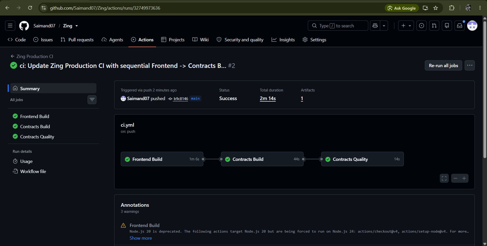

<div align="center">

# Zing

### Full-Stack DeFi Trading, Prediction Market & Token Launchpad on Stellar Soroban

Trade with Zero Gas · Predict On-Chain · Launch Tokens · Built on Stellar Testnet

[](https://github.com/Saimand07/Zing)
[](https://stellar.org)
[](https://soroban.stellar.org)
[](https://nextjs.org)
[](#)

</div>

---

## Comprehensive Overview

Zing is a full-stack, non-custodial decentralized exchange, token launchpad, prediction market, and social growth platform built natively for the Stellar and Soroban ecosystem. Developed across multiple progressive phases, Zing abstracts away the complexity of gas fees, slippage, and liquidity routing using declarative user intents and a solver network, letting users focus on trading, launching, and growing their communities.

### Core Protocol Stack & Features

1. **Polymarket-Style Soroban Prediction Markets (`prediction_market`)**
   - **Binary Outcome Markets**: Trade YES/NO outcome shares on real-world events across Crypto, DeFi, AI, and Macroeconomics.
   - **XLM-Native Staking**: Each vote stakes real Stellar Lumens into Soroban escrows with dynamic odds calculations, share pricing, and payout estimations.
   - **Contest Creation Engine**: Community members can deploy new prediction contests on-chain with customized resolution criteria.
   - **Live Vote Coverage Chart**: Real-time YES/NO probability curves with gradient fills, pulse markers, interactive hover crosshairs, and multi-timeframe toggles (`1H`, `6H`, `24H`, `7D`, `ALL`).
   - **1-Click Claims**: Dedicated portfolio tab to track active stakes and instantly claim winnings from resolved markets.

2. **DeFi 2.0: Zero-Gas Intent-Based Swap Protocol (`intent_swap`)**
   - **Declarative User Intents**: Users specify their desired output (e.g., "Trade 100 USDC for at least 95 XLM"), eliminating manual slippage adjustments and failed transactions.
   - **Solver Network Execution**: Off-chain solvers compete to fill user orders with optimal routing, paying gas fees on behalf of the user.
   - **Cross-Chain Abstraction**: Seamlessly routes liquidity across Stellar, NEAR Intents, Axelar, and Ethereum/Solana via Circle CCTP.

3. **Zing LaunchZone (`launchpad`)**
   - **No-Code Asset Issuance**: Issue custom Stellar assets and Soroban tokens with customized supply, metadata, and categories in under 60 seconds.
   - **Trustline Automation**: Builds and signs atomic trustline transactions for distributor and recipient accounts.
   - **Live LaunchBoard**: Browse all launched tokens with real-time market data and social metrics.

4. **User Authentication & Profile Suite**
   - **Hybrid Authentication**: Supports standard Email/Password and Web3 Stellar Wallet onboarding (Freighter, Albedo, xBull).
   - **Automated Wallet Binding**: Automatically binds the user's Stellar public key to their Supabase profile on connection.
   - **Customizable Metadata**: Edit username, bio, Twitter/X handle, and avatar directly from the application.
   - **Live Asset Balances**: Real-time balance sync for XLM, USDC, and AQUA fetched from Horizon testnet.

5. **On-Chain Transaction Ledger (`user_transactions`)**
   - **Automatic Activity Tracking**: Every on-chain event (Prediction Bet, Contest Creation, Token Launch, Swap Intent, Claim) is automatically logged to Supabase.
   - **Interactive History Table**: Filter transactions by type, view status badges, verify amounts, and inspect direct Stellar Expert explorer links.

6. **Social Booster & Trading Competitions (`campaign`, `competition`)**
   - **MindShare Campaigns**: Reward community members for social growth and quest completion via escrowed reward pools.
   - **Leaderboard Tournaments**: Compete in live trading tournaments with real-time ranking calculated from on-chain DEX trades.

7. **Non-Custodial Smart Wallet (`smart_wallet`)**
   - Account abstraction with session keys and multi-asset routing.
   - `require_auth` enforcement on all state-mutating contract calls.

8. **Multi-Stage Production CI/CD Pipeline**
   - 3-stage sequential GitHub Actions: Frontend Build → Contracts Build → Contracts Quality.
   - Zero CI failures permitted; strict TypeScript and Rust `cargo fmt` validation on every push.

---

## Detailed Project Structure

```
Zing/
├── .github/
│   └── workflows/
│       └── ci.yml                      # Master 3-Stage Ordered CI/CD Pipeline
│
├── src/
│   ├── app/                            # Next.js App Router (Pages & API Routes)
│   │   ├── auth/                       # Authentication Portal (Sign In / Sign Up)
│   │   ├── profile/                    # User Profile & Stored Transaction Ledger
│   │   ├── dashboard/                  # Ecosystem Analytics & Market Overview
│   │   ├── trade/                      # Spot Trading & Intent Engine
│   │   │   └── predictions/            # On-Chain Prediction Markets & Live Charts
│   │   ├── launch/                     # Token & Agent LaunchZone
│   │   │   └── create/                 # No-Code Token Issuance Wizard
│   │   ├── analytics/                  # Public Platform Analytics Dashboard
│   │   ├── admin/                      # Admin Console (Role-Based Access Control)
│   │   ├── social-booster/             # Social Quest Campaigns
│   │   ├── competitions/               # On-Chain Trading Competitions
│   │   ├── contracts/                  # Deployed Contracts Directory
│   │   ├── settings/                   # User Preferences
│   │   ├── api/
│   │   │   └── intents/                # Intent Swap Solver API Routes
│   │   ├── error.tsx                   # Route-level Error Boundary
│   │   ├── global-error.tsx            # Global Error Boundary
│   │   └── loading.tsx                 # Global Suspense Loading Skeleton
│   │
│   ├── components/                     # Modular React UI Components
│   │   ├── prediction-vote-chart.tsx   # Real-Time Vote Coverage & Probability Curve
│   │   ├── trading-chart.tsx           # Candlestick Market Chart (lightweight-charts)
│   │   ├── auth-provider.tsx           # Supabase Auth & Profile Context
│   │   ├── wallet-provider.tsx         # Stellar Wallets Kit Integration
│   │   ├── nav.tsx                     # Top Navigation Bar
│   │   ├── app-sidebar.tsx             # Responsive Off-Canvas Navigation Sidebar
│   │   └── toast-provider.tsx          # Global Toast Notification System
│   │
│   └── lib/                            # Web3 & Database Utilities
│       ├── stellar-predictions.ts      # On-chain prediction transaction builder
│       ├── transactions.ts             # Database transaction ledger recorder
│       ├── stellar-trade.ts            # Horizon balance & DEX pathfinders
│       ├── stellar-launch.ts           # Asset issuance & trustline builders
│       └── supabase.ts                 # Supabase database client proxy
│
├── contracts/                          # Soroban Rust Contracts Workspace
│   ├── prediction_market/              # Binary outcome prediction contract
│   │   └── src/lib.rs                  # #[contracterror] enum error handling
│   ├── intent_swap/                    # Zero-gas intent-based atomic swap
│   │   └── src/lib.rs                  # Solver routing & MEV resistance
│   ├── launchpad/                      # Token Launchpad & Factory
│   │   └── src/lib.rs                  # No-code asset issuance & liquidity bootstrap
│   ├── smart_wallet/                   # Account abstraction smart wallet
│   │   └── src/lib.rs                  # Session keys & multi-asset routing
│   ├── campaign/                       # Social Booster campaigns
│   │   └── src/lib.rs                  # Quest validation & reward distribution
│   ├── competition/                    # Trading competitions
│   │   └── src/lib.rs                  # DEX volume tracking & prize distribution
│   └── token/                          # Soroban Token standard implementation
│       └── src/lib.rs                  # SEP-41 compliant token contract
│
├── supabase/
│   └── migrations/                     # PostgreSQL Schema Migrations
│       ├── 20260717000000_init.sql
│       └── 20260824000000_user_profiles_and_transactions.sql
│
├── public/
│   ├── Screenshot/                     # Feature Screenshots
│   └── logo.jpg                        # Zing Brand Logo
│
├── Cargo.toml                          # Rust Workspace Manifest
├── package.json                        # Dependencies (Next 16, Stellar SDK, Framer Motion)
└── README.md                           # Protocol Documentation
```

---

## Live Deployment

| Resource | Details |
|----------|---------|
| **GitHub Repository** | [github.com/Saimand07/Zing](https://github.com/Saimand07/Zing) |
| **Network** | Stellar Testnet |
| **Soroban RPC** | `https://soroban-testnet.stellar.org` |
| **Horizon API** | `https://horizon-testnet.stellar.org` |
| **Stellar Wallet** | [Freighter](https://www.freighter.app/) — set to Testnet |

---

## Smart Contract Deployments

All contracts are written in Rust, compiled to `wasm32-unknown-unknown`, and deployed natively on the **Stellar Soroban Testnet**.

| Contract | Address | Explorer |
|----------|---------|---------|
| **Prediction Market** | `CCO6P3MRIXHFPSAQF5IQ7DENWJDJMAJXWFE3DTPHYIRMEMUT4KQKPMNR` | [View on StellarExpert](https://stellar.expert/explorer/testnet/contract/CCO6P3MRIXHFPSAQF5IQ7DENWJDJMAJXWFE3DTPHYIRMEMUT4KQKPMNR) |
| **Intent Swap Engine** | `CCSJQNIM7UWJLMRDD5VSPQDUNQKG5A7VZZVVGOOLMTLG3RIQY5NQIRH7` | [View on StellarExpert](https://stellar.expert/explorer/testnet/contract/CCSJQNIM7UWJLMRDD5VSPQDUNQKG5A7VZZVVGOOLMTLG3RIQY5NQIRH7) |
| **Zing Launchpad** | `CCQKDOJRON3D4PZC4YNCTVMYR566VEPWYRFTF2JGFTO5EPZLJUBKKS46` | [View on StellarExpert](https://stellar.expert/explorer/testnet/contract/CCQKDOJRON3D4PZC4YNCTVMYR566VEPWYRFTF2JGFTO5EPZLJUBKKS46) |
| **Smart Wallet & Routing** | `CDTQYDT2EJ7WAIMGY33546CKKS46MP2CBSL5QNCXFNQTHL5EL7GPYLAY` | [View on StellarExpert](https://stellar.expert/explorer/testnet/contract/CDTQYDT2EJ7WAIMGY33546CKKS46MP2CBSL5QNCXFNQTHL5EL7GPYLAY) |
| **Social Booster (MindShare)** | `CBDNXFONMLWTIQLSFONXDDTBIPWZ7LRV7BLAMYEA4K37IAETH424IOWC` | [View on StellarExpert](https://stellar.expert/explorer/testnet/contract/CBDNXFONMLWTIQLSFONXDDTBIPWZ7LRV7BLAMYEA4K37IAETH424IOWC) |
| **Trading Competitions** | `CAHXXMYINOBWAAYBHETS6C5NKX4S4F4OHWV7EFLX6PY7QB3RCSQMQO2T` | [View on StellarExpert](https://stellar.expert/explorer/testnet/contract/CAHXXMYINOBWAAYBHETS6C5NKX4S4F4OHWV7EFLX6PY7QB3RCSQMQO2T) |

---

## Screenshots

### Landing Page

> Zing's entry point — dark glassmorphism hero with search, wallet connect, and live network status.

---

### Dashboard

> Ecosystem analytics and market overview — trending assets, Fear & Greed Index, global market cap, and live project feed.

---

### Trade Terminal

> Spot trading terminal with real-time candlestick charts, DEX orderbook, and intent-based swap panel.

---

### Prediction Market

> On-chain prediction markets — real-time YES/NO probability curves, XLM staking, live vote coverage chart.

---

### Launch Board

> Token LaunchZone — browse all community-launched Stellar assets with market data and social metrics.

---

### Token Launch

> No-code token issuance wizard — set supply, metadata, and category in under 60 seconds.

---

### Token Creation Transaction

> On-chain confirmation detail after issuing a custom Stellar asset, with Stellar Expert verification link.

---

### Token Bar

> Live asset ticker bar — XLM, USDC, AQUA balances and prices synced from Horizon testnet in real time.

---

### Wallet Connected

> Freighter wallet connection modal — supports Freighter, Albedo, and xBull with auto-profile binding.

---

### Swapped Transaction

> Successful intent-based swap confirmation — solver-routed, zero-gas atomic XLM/USDC exchange.

---

### CI/CD Pipeline

> GitHub Actions 3-stage sequential pipeline: Frontend Build → Contracts Build → Contracts Quality.

---

### CI/CD Status

> All three CI checks ticked green on a passing main branch commit.

---

## System Architecture

```
┌─────────────────────────────────────────────────────────────────────┐
│                          USER / AI AGENT                            │
└─────────────────────────────────────────────────────────────────────┘
        │
        │  Declarative Intent (e.g. "Swap 100 USDC for 95+ XLM")
        ▼
┌──────────────────────────────────────────────────────────────────────┐
│                  Zing Intent Router & Solver API                     │
│              (Generates optimal XDR / Soroban Intents)               │
└──────────────────────────────┬───────────────────────────────────────┘
                               │
              ┌────────────────┴─────────────────┐
              │                                  │
              ▼                                  ▼
 ┌─────────────────────────┐     ┌─────────────────────────────────────┐
 │   Stellar Wallet        │     │       Zing Next.js Frontend         │
 │   (Freighter / Albedo)  │     │  /trade  /predictions  /launch      │
 │                         │────▶│  /profile  /analytics  /admin       │
 │   Signs XDR Locally     │     └──────────────────────────┬──────────┘
 └─────────────────────────┘                                │
                                                            │
                               ┌────────────────────────────┘
                               │
              ┌────────────────┴─────────────────┐
              │                                  │
              ▼                                  ▼
 ┌─────────────────────────┐     ┌─────────────────────────────────────┐
 │  Stellar Execution Layer │    │       Supabase Database             │
 │  (Horizon / Soroban RPC) │    │  user_profiles  user_transactions   │
 └────────────┬────────────┘     └─────────────────────────────────────┘
              │
              ▼
 ┌────────────────────────────────────────────────────────────────────┐
 │                    Soroban Smart Contracts                         │
 │  prediction_market  intent_swap  launchpad  smart_wallet           │
 │  campaign           competition  token                             │
 └────────────────────────────────────────────────────────────────────┘
```

---

## Local Setup & Development

### Prerequisites

- Node.js 20+
- Rust with target `wasm32-unknown-unknown`
- `stellar-cli` (optional, for deploying contracts)
- [Freighter Wallet](https://www.freighter.app/) set to **Testnet**

### Quick Start

```bash
# Clone the repository
git clone https://github.com/Saimand07/Zing.git
cd Zing

# Install frontend dependencies
npm install

# Configure environment
cp .env.example .env.local
# Fill in NEXT_PUBLIC_SUPABASE_URL and NEXT_PUBLIC_SUPABASE_ANON_KEY

# Run development server
npm run dev
```

### Contract Build Commands

```bash
# Build all contracts
cd contracts
cargo build --target wasm32-unknown-unknown --release

# Build a specific contract
cargo build --package prediction_market --target wasm32-unknown-unknown --release

# Format Rust code
cargo fmt
```

---

## Security & Non-Custodial Architecture

- **Client-Side Key Management**: Zing never holds or transmits private keys. All transactions are signed locally in the user's browser extension via `@creit.tech/stellar-wallets-kit`.
- **Soroban `require_auth`**: All smart contract state mutations enforce strict caller authentication checks.
- **Fail-Safe Client Proxy**: Supabase interactions use a resilient no-op fallback in `src/lib/supabase.ts`, preventing app crashes during network downtime.
- **Error-Safe Contracts**: The `prediction_market` contract uses `#[contracterror]` enums instead of `panic!`, providing safe, machine-readable error propagation to the frontend.

---

## License & Disclaimer

Testnet experimental build. Built for the Stellar & Soroban ecosystem. Open source under the MIT License.
